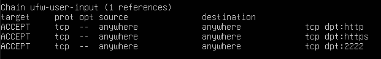

## Uvod

Cilj ovog zadatka je da kongfigurišemo Linux serversku mašinu sa pokrenutim projektom i izvedemo pregled sistema i očvršćavanje. Operativni sistem korišćen za serversku mašinu je Linux, Ubuntu verzija 24.04.

Podešeni kredencijali

## Logovanje

Praćenje sistema je započeto, a zapisi se skladište u odgovarajuće fajlove što se može videti na slici. 

Logovanje događaja se radi korišćenjem rsyslog servisa. Preporučeno je da se logovi čuvaju na udaljenom serveru. 

## Ranjivosti verzije 

Verzija: Linux 6.8.0-31-generic
Bez dostupnih ažuriranja

## Sinhronizacija vremena sa NTP serverom

Na slici je prikazana lista procesa koji su povezani sa NTP serverom i listu udaljenih NTP servera sa kojim je lokalni server povezan

## Instalirani paketi

Da bi sistem bio što manje izložen potrebno je da broj instaliranih paketa bude što manji. 
Pronađeni nepotrebni paketi: libx11-6:amd64, libx11-data, python3-xkit

## Firewall

Sigurnosni mehanizam za kontrolu protoka podataka u mreži i između mreža. Aktiviran i dopušten je saobraćaj kroz tri porta: 22 - SSH, 80 - HTTP, 443 - HTTPS. Za pristup virtuelnoj mašini sa fizičke host mašine neophodni su generisani ključevi. Dozvoljen je i pristup saobraćaju iniciranom od samog servera. 

Da bi se smanjila površina potencijalnog napada IPv6 adrese su onemogućene.

## Pregled fajl sistema 

Opcija noatime se ne koristi, a opcije noexec i nosuid su dodate.

Setuid fajlovi - fajlovi koji se izvršavaju sa privilegijama njihovog vlasnika, a ne trenutnog korisnika.
 
 -rwsr-sr-x 
 s oznacava da se izvrsava kao setuid fajl, a x sa privilegijama trenutnog korisnika

 Na slici je prikazana lista datoteka izvan direktorijuma procesa (/proc) koje može pisati/menjati bilo koji korisnik.

## Pregled korisnika

Passwd fajl služi za skladištenje osnovnih podataka o korisnicima kao što su korisničko ime, UID, putanja do korisničkog shell-a... Prikaz passwd fajla je na slici:

Shadow fajl služi za skladištenje kriptovanih (hešovanih) lozinki, informacije o isteku lozinki, poslednjoj promeni... Konkretno, za korisničku lozinku se koristi SHA-512 algoritam ($6$), dok se po default-u u konfiguraciji nalazi da se za hešovanje koristi yescrypt algoritam.

Prikaz sudoers fajla sa definisanim privilegijama korisnika se nalazi na sledecoj slici

## Pregled servisa

Otvorene TCP konekcije sistema su prikazane na sledećoj slici 

### SSH

SSH konfiguracija je prikazana na sledećoj slici. Port je promenjen sa defaultne vrednosti 22 na 2222. Takođe i konfiguracija firewall-a je promenjena. PermitRootLogin ima vrednost no što zabranjuje root korisniku direktno povezivanje na sistem preko SSH. PubkeyAuthentication ima vrednost yes što omogućava autentifikaciju putem javnih ključeva umesto lozinki što je sigurnija opcija.

Preko SSH sesije korisnici mogu prosleđivati saobraćaj TCP protokolom na druge računare. Ovo se može zloupotrebiti za pristup drugim sistemima pa je ovde onemogućeno.

Na narednim slikama je prikazana otvorenost portova korišćenjem iptables i ufw komandi.

### Apache2

conf-available/security.conf

Kako bi se onemogućilo listanje direktorijuma parametar Indexes je promenjen u -Indexes

Nema PHP-a, nije omogućen

